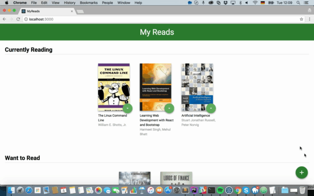
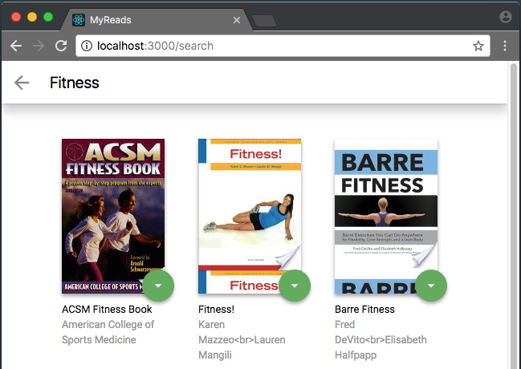

# MyReads
---

## Project Purpose:

This project was built for the [Udacity's](https://www.udacity.com) React and Front End Nanodegree Programs. The purpose of the project is to demonstrate understanding of the basic structure and operation of a [React](https://reactjs.org) based app. This bookshelf app allows the user to select and categorize books you have read, are currently reading, or want to read. The project comes with an API server and client library that is used to persist information as you interact with the application. Students are expected to add interactivity to the app.



## How to Load the App

The project uses Node.js and the Create-React-App starter.  If you do not have Node >= 6.x installed, you can download it here: [Node.js](https://nodejs.org/en/)

Once Node is installed, navigate to the directory where you want to store the app
```
git clone https://github.com/carlotapearl/myreads.git
npm install
```
Once all of the dependencies have been installed you can launch the app with
```
npm start
```
A new browser window should automatically open displaying the app.  If it doesn't, navigate to [http://localhost:3000/](http://localhost:3000/) in your browser


## How to Use the App
* Books are sorted into three categories: Currently Reading, Want to Read and Read
* To change a book's category or remove a book from the list, click on the green button on  the book cover


* To add new books, click on the green + button at the bottom of the page.
Enter an author's name or subject. Up to 20 items will be returned.

*Note: The backend API is limited to a fixed set of visit [SEARCH TERMS.MD](SEARCH_TERMS.md) to view the valid search options. ONLY the terms provided in this list will come back in the results.*



### Resources and Documentation:
* [Create-react-app Documentation](https://github.com/facebookincubator/create-react-app)
* [React Router Documentation](http://knowbody.github.io/react-router-docs/)
* [React Training/React Router](https://reacttraining.com/react-router/web/api/BrowserRouter)
* [React API](https://facebook.github.io/react/docs/react-api.html)

### Udacity Resources:
* [Project starter template](https://github.com/udacity/reactnd-project-myreads-starter)
* [Project Rubric](https://review.udacity.com/#!/rubrics/918/view)
* [Udacity CSS Style Guide](http://udacity.github.io/frontend-nanodegree-styleguide/css.html)
* [Udacity HTML Style Guide](http://udacity.github.io/frontend-nanodegree-styleguide/index.html)
* [Udacity JavaScript Style Guide](http://udacity.github.io/frontend-nanodegree-styleguide/javascript.html)

*This project is licensed under the terms of the MIT license.*